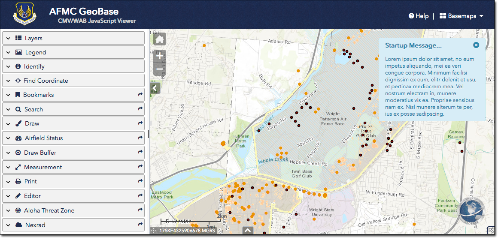

# AFMC Configurable Map Viewer 
AFMC-CMV Version 1.0.0 beta 

## Introduction
__[CMV](https://cmv.io/)__ is a community-supported open source mapping framework. CMV works with the __[Esri JavaScript API](https://developers.arcgis.com/javascript/jsapi/3/)__, __[ArcGIS Server](https://www.esri.com/software/arcgis/arcgisserver)__, __[ArcGIS Online](https://arcgis.com/)__ and more.

AFMC has extended and modified the CMV code base to support the GeoBase Mission and improve compatibility when running on the AFNet environment. There are many reasons for using CMV as a starting point for the GeoBase Viewer:
- This JavaScript web app can be easily configured or used as a boilerplate/starting point for basic and advanced viewers. It also demonstrates best practices for modular design and OOP via classes in JS using dojo's __[declare](https://dojotoolkit.org/reference-guide/1.9/dojo/_base/declare.html)__ system.
- The CMV Viewer supports a large collection of Widgets developed by ESRI, CMV developers and other contributors, including Widgets written for ESRI's WEB App Builder (WAB) framework.
- There are large number of widgets built into the core viewer and many more widgets available from ESRI as well as __[widgets contributed](https://github.com/cmv/cmv-contrib-widgets)__ by the CMV developer community.
- The CMV framework is currently being used by nearly all CONUS GeoBase programs and has a group of talented administrators and developers supporting it.
- The open source framework allows the GeoBase program to spend its resources wisely, focusing on adding capabilities specific to their needs and not readily available from other sources rather than expending time and effort building and maintaining common capabilities.

## Widgets (AFMC Configuration):

#### Off-Panel Widgets
- Growler (dijit)
- Basemaps (dijit)
- Scalebar (dijit)
- Home (WAB)
- Overview Map (dijit)
- Help (dijit)
- Map Coordinates (WAB)
- Attributes Table (WAB)

#### Panel Widgets
- Layers TOC (dijit)
- Legend (dijit)
- Identify (dijit)
- Find Coordinate (widget ACC)
- Bookmarks (dijit)
- Search (widget CMV)
- Draw (WAB)
- Feature Status (widget AFMC)
- Draw Buffer (widget AFMC)
- Measure (widget CMV)
- Print (dijit)
- Editor (dijit)
- Aloha Threat Zone (widget WAB)
- Nexrad (widget CMV)

Read more about the __[core widgets](https://docs.cmv.io/en/latest/widgets/)__. In addition, there is a growing number of __[widgets contributed by the CMV developer community](https://github.com/cmv/cmv-contrib-widgets)__.

## Installation
The installation process...

1. Copy the distribution package to your web/application server.

2. Remote into your web server and extract the archive to your ___applicaitons__ directory (or other location normally used to keep web sites and applications, such as the /inetpub/wwwroot folder).

3. If the extract location is not the IIS root folder, create a virtual directory in IIS at the root of your default website. Name the virtual directory __cmv__, and point it to the location of the extracted CMV folder.

4. In IIS, verify the default documents list contains an entry for the __index.html__ file name.

5. Test the core/demo viewer by accessing the url for your cmv with the following url: __https://[HOST]/cmv/index.html?config=wab__. This should load a demo configuration of the CMV.

## Configuring CMV for AFMC
Configuring the CMV viewer involves editing several JavaScript files located in the __/cmv/js/config/__ folder. Using your favorite text editor, edit each of the files below to update the configuration for your site.

1. __viewer.js__ - This is the primary configuration file for the AFMC viewer. It contains the settings for the viewer's layout, map layers, and widgets.

  a) Locate the __operationalLayers__ section of the file. Update the url value associated with service titled __AFMC Common Installation Picture (CIP)__. The url should refer to the rest endpoint for the dynamic map service hosting your CIP data.

  b) In the __widgets__ section of the file, locate the __simpleBuffer__ widget configuration section. Update the __featureServiceURL__ value to refer to the rest endpoint of your CIP map service. Then update the __featureServiceLayers__ list to include the id's  of each layer that users can create buffers on, at a minimum, include the buildings layer id. The id is the number associated with the layer as listed in the map service's rest info.

  c) In the __widgets__ section of the file, locate the __print__ widget configuration section. Update the __printTaskURL__ value to refer to the rest endpoint of your __Export Web Map Task__ service. It is normally located at: Services > Utilities > Printing Tools (GPServer) > Export Web Map Task, so you should be able to change just the hostname of the pre-configured printTaskURL. You should also verify in ArcGIS Server Manager that the service is started, as it is not set to startup by default.

2. __identify.js__ - At this point there is nothing to change in this file, just be aware that this file is used to configure and add popup definitions for your identify results.

3. __search.js__ - This is the configuration file used by the __Search__ widget. It specifies the different searches users will be able to choose from and perform by outlining the layers, fields, and display results information for each search option defined in the __layers__ section. At this point there should be nothing to change in this file, but to be certain verify the following field names for your buildings layer.

  a) If necessary, update every occurrence of the field name __INSTALLATIONID__ in the file to refer to the field containing the four letter installation code for the AFMC bases, e.g. 'ZHTV'.

  b) If necessary, update every occurrence of the field name __BUILDINGNUMBER__ in the file to refer to the field containing the commonly used building identifier or building number.

  c) If necessary, update every occurrence of the field name __SDSFEATURENAME__ in the file to refer to the field containing the commonly used building name.

  d) If necessary, update every occurrence of the field name __BUILDINGSTATUS__ in the file to refer to the field containing the building status information.

  e) If necessary, update every occurrence of the field name __SITEID__ in the file to refer to the eight character SDSFIE site identifier code, e.g. 'ZHTV0001'.

5. __wabapp-config.js__ - This file contains configuration to support the Web App Builder (WAB) components.

  a) Locate and update the __geometryService__ value to refer to the rest endpoint of your __Geometry__ service. It is normally located at: Services > Utilities > GeometryServer so you should be able to change just the hostname of the pre-configured geometryService. You should also verify in ArcGIS Server Manager that the service is started, as it is not set to startup by default.

6. __Test the AMFC viewer__ configuration by accessing the url for your cmv with the following url: __https://[HOST]/cmv/index.html__. This should load the AFMC configuration of the CMV as shown in the screenshot at the top of this document.

## Additional Documentation:
The CMV community maintains [documentation](https://docs.cmv.io/) for getting started and guidance on configuring your application. This documentation is a bit sparce at this point but is a good place to start when trying to update and extend your configuration.

## Change log:
See the [GitHub Releases](https://github.com/cmv/cmv-app/releases) for change logs for all versions of the core CMV viewer framework.

Noteworthy changes to the AFMC version of the framework include:
- Internalize hosted JavaScript Libraries (including Esri's JavaScript API v.3.20) to allow the framework to run on the restricted and unpredictable AFNet environment.
- Incorporate WAB Widget components from the cmv-wab-widgets project.
- Resolve issues/conflicts with the LyerControl widget (layer toggling, sub-layer visibility and action menus)
- Resolve issues/conflicts with the Coordinate widget (map-click event conflicts, set MGRS as displayed coords)
- Incorporate relevant custom widgets from the greater GeoBase and CMV community of developers: Find Coordinate, Map Coordinates, Search, Attribute Tables, Measure, Aloha Threat Zones, Nexrad weather radar feed.
- Add Draw Buffer widget that supports buffering 1) user markup, 2) MGRS coordinates, and 3) feature selection.
- Add Feature Status widget that allows users to click a feature to display status infos for the feature (e.g airfield surface, building condition, etc.)
