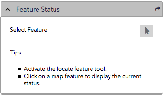
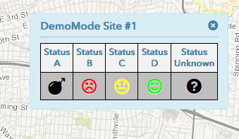

# Feature Status Widget
A configurable widget to display status information for one or more features in a map popup using growler notifications.

|Widget In Panel                                    |Status Results in Growler pop-up                         |
|:-------------------------------------------------:|:-------------------------------------------------------:|
|||


## Widget Configuration
Add the widget configuration object to the widgets object in your viewer config file, e.g., viewer.js.

``` javascript
	featureStatus: {
		include: true,
		id: 'featureStatus',
		type: 'titlePane',
		path: 'gis/widgets/FeatureStatus',
		canFloat: true,
		title: 'Feature Status',
		open: false,
		position: 0,
		options: {
			map: true,
			demoMode: true,
			drillDownIdentify: false,
			displayTime: -1,
			featureServiceURL: 'https://HOSTNAME/arcgis/rest/services/MAP_SERVICE/MapServer',
			featureServiceLayers:[
				{
					layerId: 1,
					layerName: 'BuildingArea',
					layerAlias: 'Buildings',
					idField: 'buildingNumber',
					statusFields: [
						{
							name: 'buildingStatus',
							label: 'Status'
						}
					]
				},
				{
					layerId: 5,
					layerName: 'SiteArea',
					layerAlias: 'Test Sites',
					idField: 'sdsFeatureName',
					statusFields: [
						{
							name: 'statusFieldAlpha',
							label: 'Alpha Status'
						},
						{
							name: 'statusFieldBeta',
							label: 'Beta Status'
						}
					]

				}
			]
		}
	},
```

* demoMode - When set to 'true' the status for any clicked point will display a set of pre-configured demo statuses. Set this value to 'false' once you have configured the following options...

* drillDownIdentify - When set to 'true' all features at the map click location will be searched. When set to 'false' only the features from the top-most visible layer are identified (the first encountered results layer).

* displayTime - The lenght of time in milliseconds (e.g. 1000 = 1 second) to display the growler status information. To keep the notification displayed until the user closes it, use the value: -1.

* featureServiceURL - Specify the map service that contains the target layer (e.g. insatallationBoundryArea) in the config options 'featureServiceURL' property.

* featureServiceLayers - An array of searchable layers. Each feature service layer object should contain the following...

	1. layerId - Specify the rest layer id (the number associated with the layer as listed in the map service's rest info) for each searchable layer.
	2. layerName - Specify the rest layer name (the name associated with the layer as listed in the map service's rest info) for each searchable layer.
	3. layerAlias - Specify the layer name you want displayed for results from each of the feature service layers.
	4. idField - Specify the field name that contains the value identifying the feature. The value wil be used as the title for the status info pop-up.
	5. statusFields - Array of objects containing the field name and label pairs for each status field to be displayed in the growler pop-up.


## Status Styles Configuration
The values returned from each status field (e.g. 'green', 'yellow', 'red', 'good', 'bad', 'ugly', etc.)  are used as the css class names for the status display. Edit the FeatureStatus.css file and add a class defintion for every unique value (preceded by an underscore) that could be retuned from your layer's status fields.

E.g. Field_A has possible status values 'RED', 'YELLOW', 'GREEN', and Field_B  has possible values 'Planning', 'In Progress', and 'Completed'; so you would add the following declarations ...

```css
	#growler_widget td._RED:before {
		color: #FF0000;
		content: '\f119';
	}
	#growler_widget td._YELLOW:before {
		color: #FFFF00;
		content: '\f11a';
	}
	#growler_widget td._GREEN:before {
		color: #FF0000;
		content: '\f119';
	}
	#growler_widget td._Planning:before {
		color: #00FF00;
		content: '\f244';
	}
	#growler_widget td._InProgress:before {
		color: #00FF00;
		content: '\f242';
	}
	#growler_widget td._Completed:before {
		color: #00FF00;
		content: '\f240';
	}
```

* FontAwesome symbols are used in the sample configuration but you could use a background image if you prefer. There's a good list of all the FontAwesome symbols at: http://astronautweb.co/snippet/font-awesome

* To ensure valid css class names, each value is pre-pended with an underscore and invalid css class name characters are removed (anything other than letters, numbers, hypens, and underscores).

* Examples:
	1. Field Value: 'green' --> CSS Class: '_green'
	2. Field Value: '1' --> CSS Class: '_1'
	3. Field Value: 'under construction' --> CSS Class: '_underconstruction'
	4. Field Value: 'On Hold (pending inspection)' --> CSS Class: '_OnHoldpendinginspection'

* Any values that are not declared in your css will be displayed with the 'Status Unknown' Icon, as shown in the Status Results screenshot at the top of this README file.

* If you are having trouble determining the css classes to declare for the status values, edit the FeatureStatus.js file and uncomment the following line to have the classes used for each result written to the console .


``` javascript
	// console.log(statusFieldValues.join(" | "))
```
