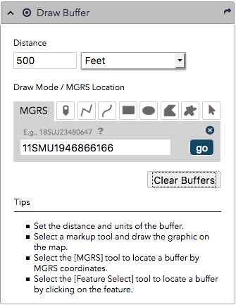
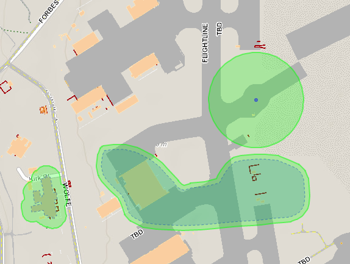

# Simple Buffer Widget
A configurable widget to display status information for one or more features in a map popup using growler notifications.

|Widget In Panel                                    |Buffer Results Samples                                        |
|:-------------------------------------------------:|:------------------------------------------------------------:|
|||


## Widget Configuration
Add the widget configuration object to the widgets object in your viewer config file, e.g., viewer.js.

``` javascript
	simpleBuffer: {
		include: true,
		id: 'simpleBuffer',
		type: 'titlePane',
		path: 'gis/widgets/SimpleBuffer',
		canFloat: true,
		title: 'Draw Buffer',
		open: false,
		position: 75,
		options: {
			map: true,
			featureServiceURL: 'https://HOSTNAME/arcgis/rest/services/MAP_SERVICE/MapServer',
			featureServiceLayers: [0,1],
			bufferedGraphicFillColor: [0, 0, 255, 0.15],
			bufferedGraphicLineColor: [0, 0, 255, 0.5],
			bufferFillColor: [0, 255, 0, 0.25],
			bufferLineColor: [0, 255, 0, 0.5],
			bufferedGeodesic: true
		}
	},
```

* featureServiceURL - Specify the map service that contains the target layers in the config options 'featureServiceURL' property.

* featureServiceLayers - An array of the layer id's (the number associated with the layer as listed in the map service's rest info) that users can creates buffers on.

* bufferedGraphicFillColor - The fill color used to highlight the feature, location, or graphic being buffered. The color should be designated as an RGB or RGBA array.

* bufferedGraphicLineColor - The outline color used to highlight the feature, location, or graphic being buffered. The color should be designated as an RGB or RGBA array.

* bufferFillColor - The fill color used to draw the buffer area on the map. The color should be designated as an RGB or RGBA array.

* bufferLineColor - The outline color used to draw the buffer area on the map. The color should be designated as an RGB or RGBA array.

* bufferedGeodesic - If the input geometries are in geographic coordinate system set bufferedGeodesic to true in order to generate a buffer polygon using a geodesic distance.
